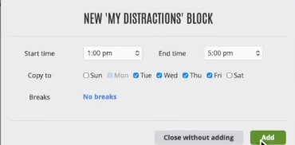
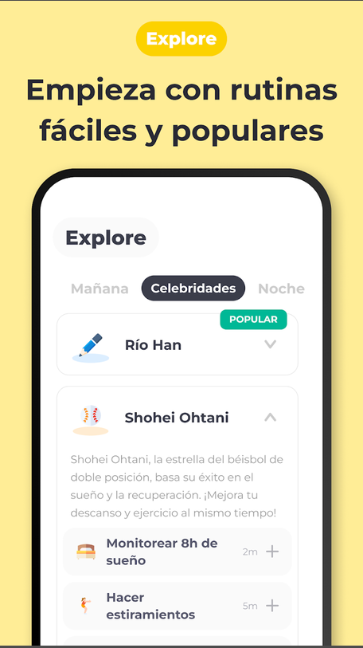

## What makes Focus Bear different from these apps?

- **Simplicity**: Many competitor apps have extensive feature sets, but the initial experience can be overwhelming and even lead to analysis paralysis. Focus Bear avoids this by keeping the interface focused and minimal.
- **Habit system with video guidance**: While other apps offer similar habit tracking, Focus Bear shows a video to guide users through each habit. This visual approach helps ease users into new routines rather than relying on text alone.

## If you were a user, why would you choose Focus Bear over competitors?

I would choose Focus Bear for several reasons:

- **Easy setup for deep work sessions**: Starting a focus session is straightforward, with minimal friction.
- **Simplicity**: The clean interface doesn't overwhelm with options.
- **AI integration**: The AI features add practical value for productivity.

## What's one feature that other apps have that Focus Bear doesn't?

Even though Focus Bear shines for its simplicity, it lacks some task management features found in competitors—like a Kanban board for visualizing workflows.

## Based on your research, what's one improvement you think Focus Bear could make?

- **More visible streaks**: Focus Bear already tracks streaks, but displaying them more prominently at first glance would better promote habit adherence.
- **Routine sharing visibility**: The app supports routine sharing, but making this feature more discoverable would help users leverage it.

## Competitor features

- **Cold Turkey**: Offers a browser extension with broader browser support compared to Focus Bear, which currently only supports Chrome and Firefox. See .

- **Freedom**: Provides better synchronization across devices—you can start a blocking session on your laptop and have it automatically apply to your phone. I tried this app briefly (see ); while the sync feature is impressive, I found the initial experience somewhat overwhelming. A more user-friendly onboarding flow would help.

- **Tiimo**: Offers a more intuitive way to track mood across your usage, allowing users to recognize patterns over time.

- **Routinery**: Allows you to start routines based on your location, making it easy to separate work, personal life, fitness, and other contexts. See . Based on my research, this is the app I'm most interested in—mainly because of the location-based routines. This feature appeals to me since I like organizing my life into distinct categories (work, fitness, mental health, etc.).

---

**Note:** Something I wish every app had is a Linux-compatible version. At the moment I'm using Ubuntu, and native Linux support would be a welcome addition—though it's not a dealbreaker.